# Data Science Training - Model Optimization

## Table of contents

1. [Installation of required tools](#installation-general)
2. [Other information](#other-information)
3. [Project structure](#project-structure)
4. [Installation guide for Windows](#installation-windows)


## Installation of required tools and Python environment <a name="installation-general"></a>

### 1. Installing Miniconda

If you already have Anaconda installed, you can skip this step.

You can download Miniconda from [here](https://docs.conda.io/en/latest/miniconda.html). Make sure you download the 64-bit
version and Python 3.x. This is very similar to Anaconda but more lightweight, it will be used to create and manage
the Python environment used. 

The Python environment is a specific installation of Python and libraries that you use for a project, you should use
different environments for different projects, making sure you do not mix depedencies.

### 2. Creating conda environment (in command line)

To create the Python environment to be used, follow the following steps:

    conda create --name ds python=3.7
    conda activate ds
    pip install -r requirements.txt

This will create a new environment called "ds" with Python version 3.7, activate this environment
and install all the packages required (such as Scikit-Learn, Pandas ,etc.). Your commanda line
must be pointing at the folder ("cd" to the folder) with the code for the "pip install"
 command to work.
 
### 3. IDE

Development is recommended to be done using PyCharm Community, which can be downloaded 
[here](https://www.jetbrains.com/pycharm/download/). After opening the code folder with PyCharm, 
sure to configure the correct conda environment to be the one on which the code runs.

## Other information <a name="other-information"></a>

### Updating requirements file

    pip freeze > requirements.txt

## Project structure <a name="project-structure"></a>

The directory structure of your new project looks like this (please adjust the structure and its description to best fit your project): 

```
├── README.md          <- The top-level README.
│
├── database
│   ├── raw_data.csv   <- Original data to simulate the system.
│   └── database.csv   <- Data to simulate the application database.
│
├── notebooks          <- Jupyter notebooks for exploratory analysis.
│
├── docs               <- Resources on Data Science and Data Mining.
│
├── requirements.txt   <- Environmnet package requirements.
│
├── simulator.py       <- Module to simulate the system in "real-time".
│
├── modeling.py        <- Module with functions to train, run and evaluate models.
│
└── frontend.py        <- Front-end application.
```

## Installation guide in Windows (no administrator rights required) <a name="installation-windows"></a>

### 1. Download Miniconda if you don't have it already (or Anaconda)
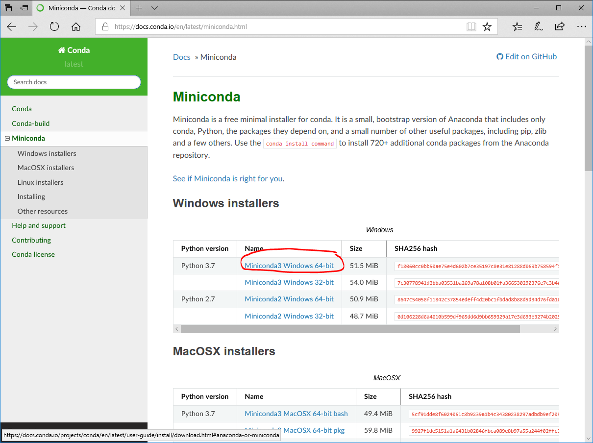

### 2. Make sure to install it for "Just me", and in you user folder
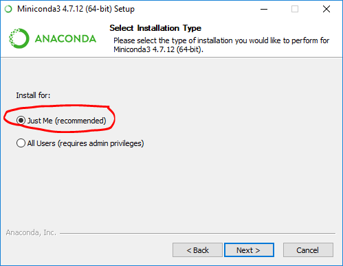

### 3. Add Anaconda to your PATH environment variable
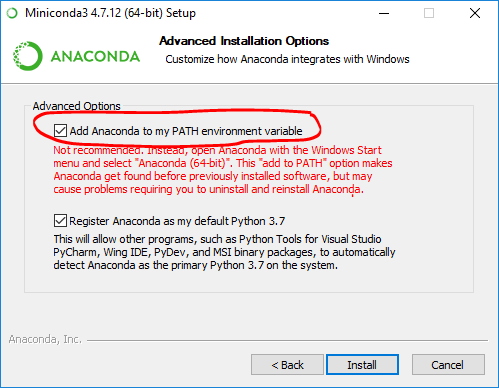

### 4. Download the repository from GitHub, if you are familiar with git you can also clone it wherever you want
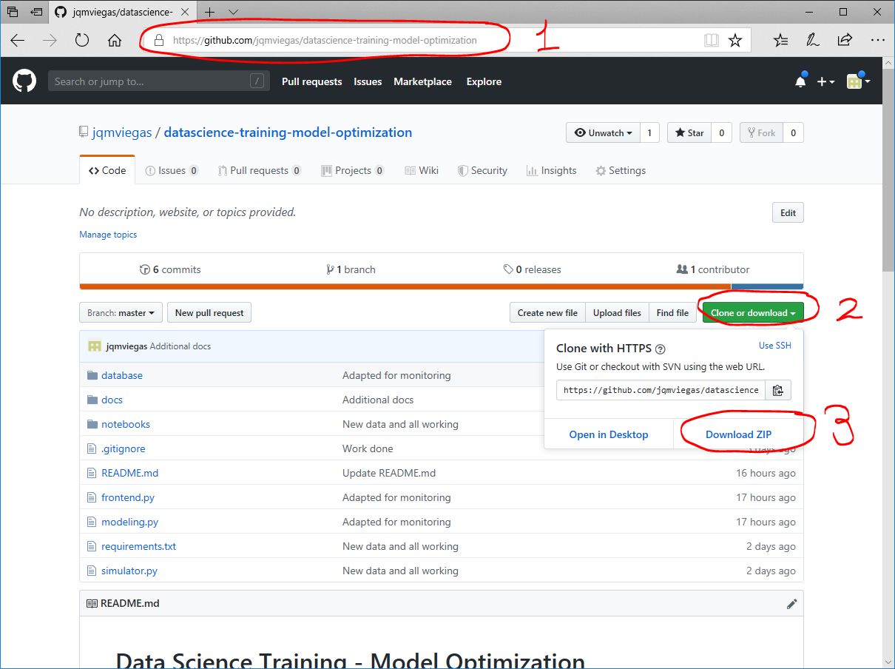

### 5. Unpack the code folder, point to it in a Command Line and create the conda environment
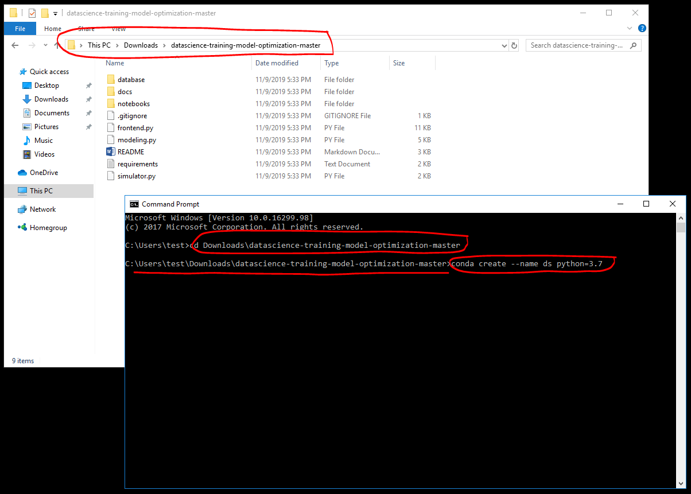

### 6. Install the required libraries using pip
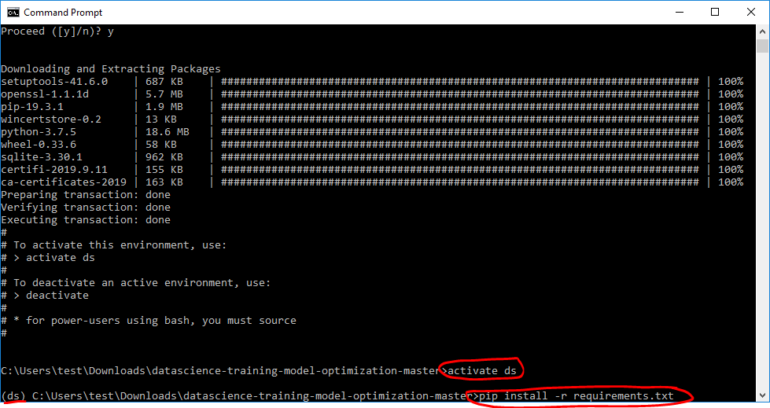

### 7. Open the project with PyCharm
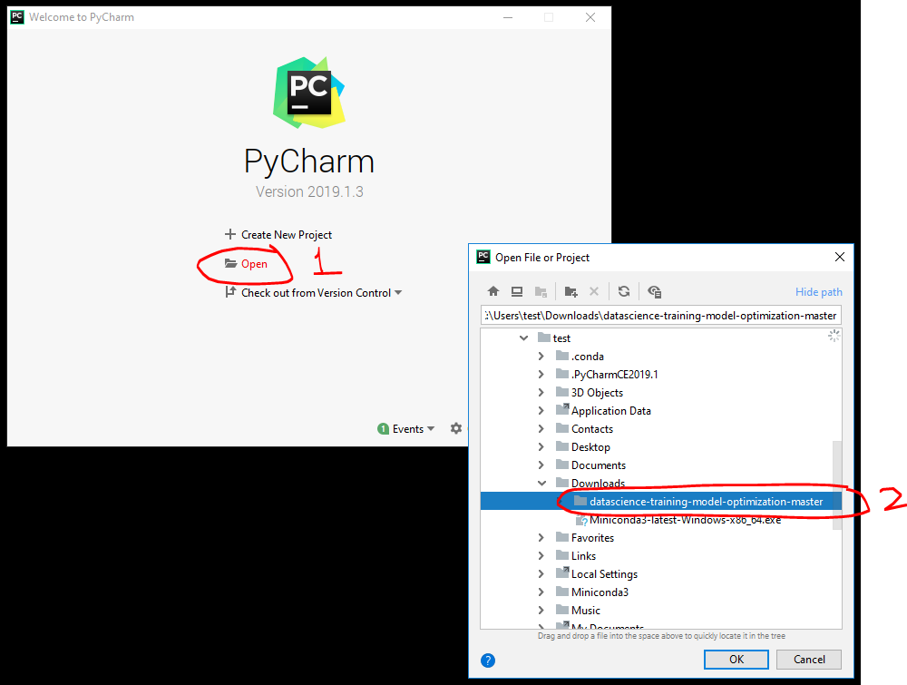

### 8. Go to Settings to configure the Python interpreter
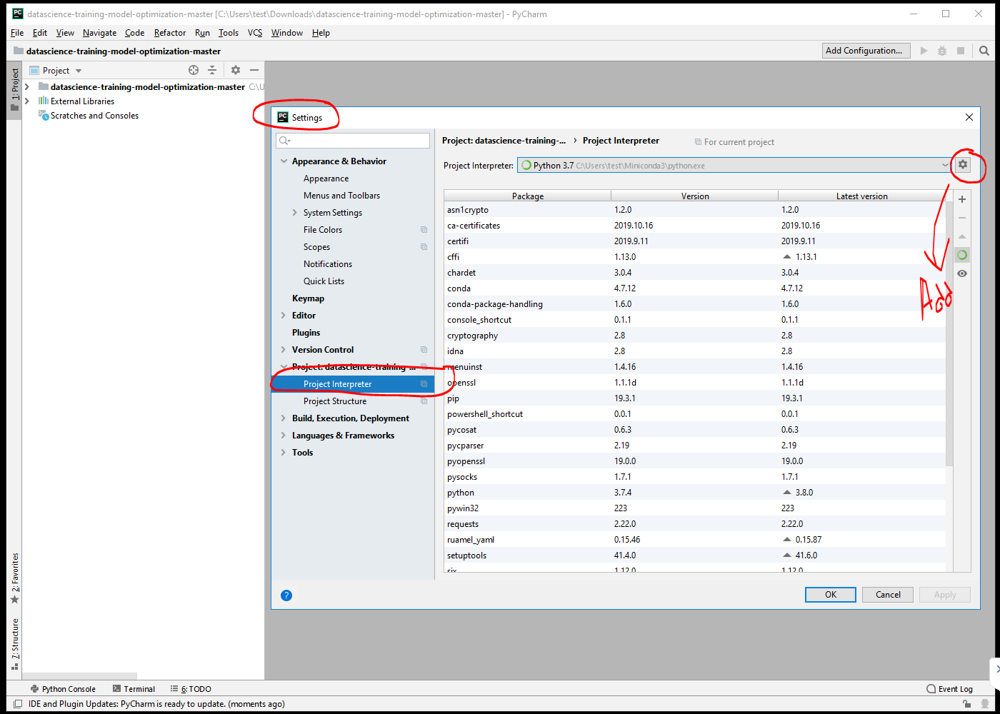

### 9. Choose the existing Conda Environment you created before (named ds)
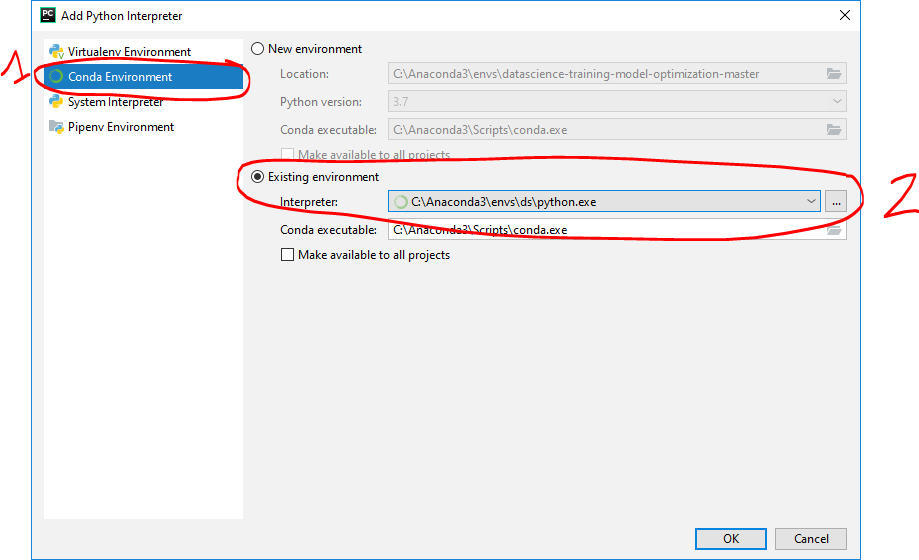

### 10. Open the file "frontend.py"
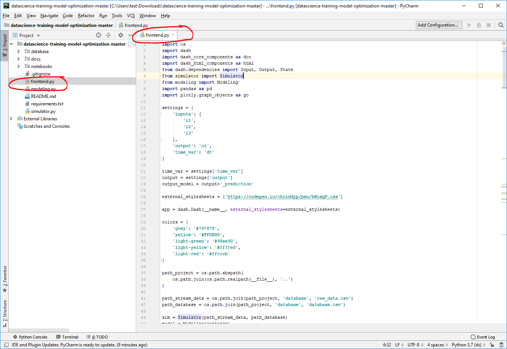

### 11. Go to Run > Run > Frontend (it may take a while to be available after changing the Python interpreter)
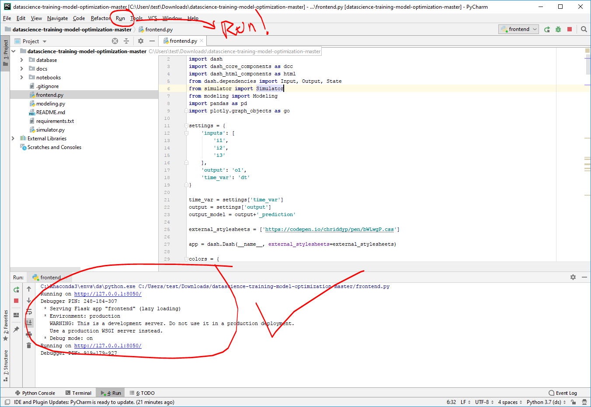

### 12. Verify that the frontend is working in your browser (does not work in Edge)
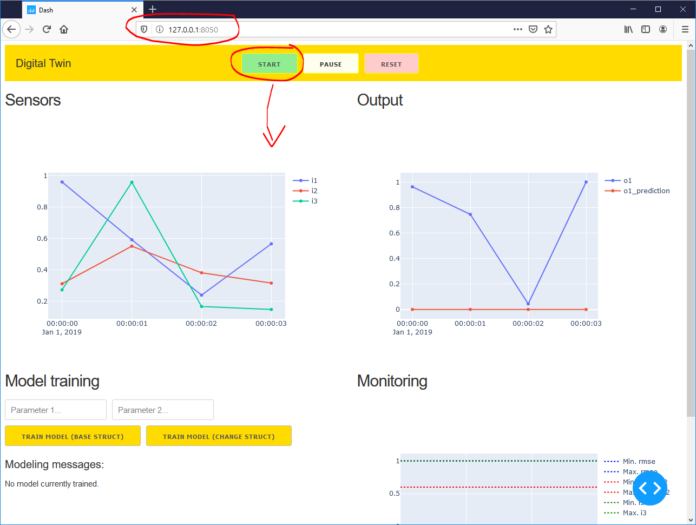

